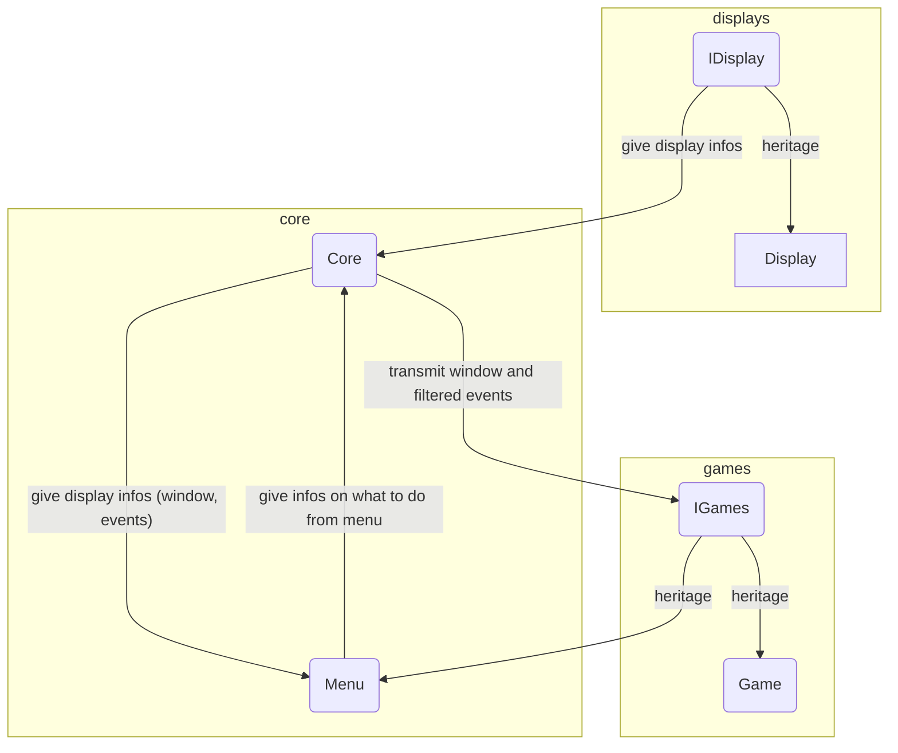

# Arcade - Hierarchical relation between the classes
This Readme describe the relation between the classes and different parts of this project.

```mermaid
flowchart TB
    subgraph displays
    ID(IDisplay) -- "heritage" ---> D[Display]
    end
    subgraph core
    C(Core) -- "give display infos (window, events)" ---> M(Menu)
    M -- "give infos on what to do from menu" ---> C
    end
    subgraph games
    IG(IGames) -- "heritage" ---> G(Game)
    end
    ID -- "give display infos" ---> C
    C -- "transmit window and filtered events" ---> IG
    IG -- "heritage" ---> M
```
